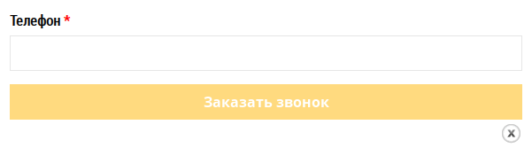
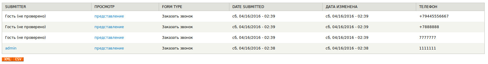

# Call me

Form with a phone and a callback button.

* Notification on e-mail about requests
* Phone number validator
* Ability to add fields
* Unloading into XML
* Unloading in Excel

Required modules from SL7:
* [sl7_control_panel](https://github.com/SemyonDragunov/sl7_control_panel)

For Drupal 7. PHP >= 5.4 & 7.

Author: Semyon Dragunov [sam.dragunov@gmail.com](sam.dragunov@gmail.com)

Apache License 2.0

***
# Заказать звонок

Форма с телефоном и кнопкой обратного вызова.

В составе модуля есть PO файл для импорта с переводом текста на русский.

* Оповещение на e-mail о заявках
* Валидатор телефонного номера
* Возможность добавления полей
* Выгрузка в XML
* Выгрузка в Excel

Требуемые модули от SL7:
* [sl7_control_panel](https://github.com/SemyonDragunov/sl7_control_panel)

Для Drupal 7.

Автор: Семён Драгунов [sam.dragunov@gmail.com](sam.dragunov@gmail.com)

Apache License 2.0